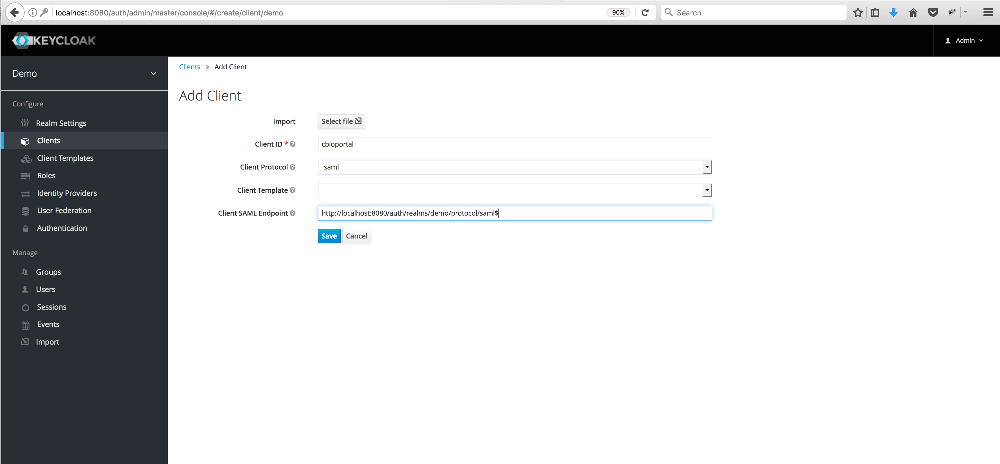
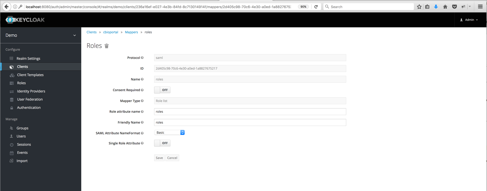
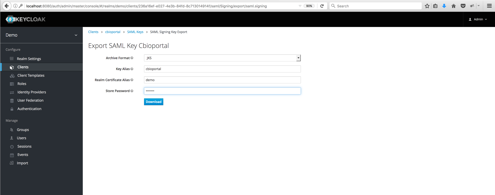

# Introduction

<<<<<<< HEAD
The cBioPortal includes support for Keycloak SAML (Security Assertion Markup Language) authentication. This document explains why you might find keycloak SAML authentication useful for helping store your user login information outside 
the cbioportal database, and how to configure Keycloak to coummunicate with your instance of cBioPortal.

Please note that configuring your local instance to support keycloak SAML authentication requires a keycloak server. For details on how to set up a keycloak server, please read online document at (https://keycloak.gitbooks.io/documentation/server_installation/index.html) .  
This documents focus mainly on the steps to configure keyclock to authenticate and authorize cbioportal users.  
=======
The cBioPortal includes support for Keycloak SAML (Security Assertion Markup Language) authentication. This document explains why you might find keycloak SAML authentication useful for storing your user login information outside 
the cbioportal database, and how to configure Keycloak to communicate with your instance of cBioPortal.

Please note that configuring your local instance to use keycloak SAML authentication requires a local/remote keycloak Identity Provider. For details on how to set up a keycloak server, please read online document at (https://keycloak.gitbooks.io/documentation/server_installation/index.html) .  
This document focuses mainly on the steps to configure the keyclock for authenticating and authorizing cbioportal users.  
>>>>>>> 38b780fcb0f1fcc8a48fe2664b8f991ebad8312a

## Why keycloak?

keycloak is an open source identity and access management solution. It has a build-in RDBM system for storing login information. It can help build a security layer on top of cBioPortal web application.

<<<<<<< HEAD
Keycloak boils down to three simple terms:
* **realm**: A realm secures and manages security metadata for a set of users, application, and registered auth clients.
* **client**: Clients are entities that can request authentication of a user within a realm.
* **role**: Roles identify a type or category of user. Keycloak often assigns access and permissions to specific roles rather than individual users for a fine-grained access control. 

KeyCloak offers three type of roles: 
=======
Keycloak boils down to three key terms:
* **realm**: A realm secures and manages security metadata for a set of users, application, and registered auth clients.
* **client**: Clients are entities that can request authentication of a user within a realm.
* **role**: Roles identify a type or category of a user. Keycloak often assigns access and permissions to specific roles rather than individual users for a fine-grained access control. 

KeyCloak offers three types of roles: 
>>>>>>> 38b780fcb0f1fcc8a48fe2664b8f991ebad8312a
* Realm-level roles are in global namespace shared by all clients. 
* Client roles have basically a namespace dedicated to a client. 
* A composite role is a role that has one or more additional roles associated with it. 


## How does Keycloak SAML Authentication work?

<<<<<<< HEAD
KeyCloak supports both OpenID-Connect and SAML authentication. When use SAML authentication, KeyCloak server exchanges XML documents with web application. XML signatures and encryption are then used to verify requests from the application.

# Configure keycloak to authenticate your cbioportal instance
**you will need to login into your keycloak server as an admin user to complete following tasks.**
1. To create a new realm mouse over the top left corner drop down menu that is titled with Master. If you are logged in the master realm this drop down menu lists all the realms created. 
The last entry of this drop down menu is always Add Realm. Click this to add a realm. Then type 'demo' in the name field and click on create button.

2. To create a SAML client go to the Clients left menu item. On this page you’ll see a Create button on the right. This will bring you to the Add Client page.
Enter in the Client ID of the client 'cbioportal'. And, enter 'http://localhost:8080/auth/realms/demo/protocol/saml' in the  Root URL textbox (This is often a URL and 
will be the expected issuer value in SAML requests sent by the application), then click on Save button. This will take you to the client page.

3. Select **saml** in the Client Protocol drop down box and **email** for Name ID Format from the client page. 
4. Next enter a redirect URL for keycloak to use upon a successful authentication e.g http://localhost:8081/cbioportal/*, and leave everything else as it is. 
5. Finally enter in the Client SAML Endpoint URL. Enter the URL you want the Keycloak server to send SAML requests and responses to e.g http://localhost:8080/auth/realms/demo/protocol/saml. Click Save. 


## Map SAML Assertion Attributes
To specify attributes included in the SAML assertion simply click on **Mapper** tab, then click on either **Add Buildin** or **Create** button. Make sure you at least add **X500 email** User Property and **roles** Role Mapper two attributes.



## Export SAML Keys
Click on **SML Keys** tab next to **Setting**, and click on **export** button, this will bring your "Export SAML Key Cbioportal" page, accept everything and type a password in Store Password textbox and click on **Download** button. 
When you are done, move the jks file to portal/src/main/resources/

## Download SAML Metadata IDPSSODescriptor file
1. Click on **Installation** tab.
2. From dropdown list of Format Option, select **SAML Metadata IDPSSODescriptor**
3. Click on **Download** button4. Move SAML Metadata IDPSSODescriptor XML file to portal/src/main/resources/


# Create Roles for authorizing cBioPortal users
* To create a role just click on the Add Role button on this page, enter in the name e.g **brca_tcga_pub** and description of the role and hit the Save button.

=======
KeyCloak supports both OpenID-Connect and SAML authentication. When you use SAML authentication, the KeyCloak server exchanges XML documents with a web application. XML signatures and encryption are then used to verify requests from the application.

# Configure keycloak to authenticate your cbioportal instance
**you will need to login into your keycloak server as an admin user to complete the following tasks.**
1. login to your keycloak Identity Provider e.g http://localhost:8080/auth as an admin user
2. Hover over the top left corner drop down menu that is titled with Master to create a new realm. 
Please Note if you are logged in the master realm, this drop down menu lists all the realms created. The last entry of this drop down menu is always Add Realm. Click this to add a realm. Then type 'yourdomain' in the name field and click on create button.
3. To create a SAML client, go to the Clients left menu item. On this page you’ll see a Create button on the right. This will bring you to the Add Client page.
Enter in the Client ID of the client e.g 'cbioportal'. 
Please note this is often a URL and will be the expected issuer value in SAML requests sent by the application. 
4. Select **saml** in the Client Protocol drop down box and use **email** for your Name ID. 
5. Next, enter a redirect URL for keycloak to use upon a successful authentication e.g http://localhost:8081/cbioportal/*, and leave everything else as it is. 
6. Finally enter in the Client SAML Endpoint URL. Enter the URL you want the Keycloak server to send requests and responses to e.g http://localhost:8080/auth/realms/yourdomain/protocol/saml. Click Save. 

## Map SAML Assertion Attributes
To specify attributes included in the SAML assertion, simply click on the **Mapper** tab, then click on either **Add Buildin** or **Create** button. 
Make sure you add at least **X500 email** User Property attribute and **roles** Role Mapper attribute.

## Export SAML Keys
Click on **SML Keys** tab next to **Setting**, and click on **export** button, this will bring your "Export SAML Key Cbioportal" page.
 Accept everything and type a password in the Store Password textbox and click on the **Download** button. 
When you are done, move the jks file to portal/src/main/resources/.
Please note you can also use the java 'keytool' to generate keystore and then import to the keycloak to customize your keystore attributes.
```
keytool -genkey -alias secure-key -keyalg RSA -keystore samlKeystore.jks
```
## Download SAML Metadata IDPSSODescriptor file
1. Click on **Installation** tab.
2. From dropdown list of Format Option, select **SAML Metadata IDPSSODescriptor**
3. Click on **Download** button
4. Move SAML Metadata IDPSSODescriptor XML file to portal/src/main/resources/


# Create Roles for authorizing cBioPortal users
* To create a role, just click on the Add Role button on this page. Enter in the name e.g **brca_tcga_pub** and description of the role and hit the Save button.
>>>>>>> 38b780fcb0f1fcc8a48fe2664b8f991ebad8312a
**To turn a regular role into a composite role, go to the role detail page and flip the Composite Role switch on.**


## Create Users and Assign Roles to a User
<<<<<<< HEAD
1. To create a user click on Users in the left menu bar. This menu option brings you to the user list page. On the right side of the empty user list, you should see an Add User button. Click that to start creating your new user.

2. Next, assign roles to each user through the Role Mappings tab for that single user.

**A composite role is a role that has one or more additional roles associated with it**. When a composite role is mapped to the user, the user also gains the roles associated with that composite. This inheritance is recursive so any composite of composites also gets inherited.
=======
1. To create a user, click on Users in the left menu bar. This menu option brings you to the user list page. On the right side of the empty user list,
 you should see an Add User button. Click that to start creating your new user.
2. Next, assign roles to each user through the Role Mappings tab for that single user.
**A composite role is a role that has one or more additional roles associated with it**. When a composite role is mapped to the user,
 the user also gains the roles associated with that composite. This inheritance is recursive so any composite of composites also gets inherited.
>>>>>>> 38b780fcb0f1fcc8a48fe2664b8f991ebad8312a


## Modifying portal.properties

<<<<<<< HEAD
1. Within portal.properties, make sure that:
=======
1. Within the portal.properties file , make sure that this line is present:
>>>>>>> 38b780fcb0f1fcc8a48fe2664b8f991ebad8312a
```
    app.name=cbioportal
```
2. Then, modify the section labeled `authentication`. See SAML parameters shown in example below:
```
    # authentication
    authenticate=saml
    authorization=true
    saml.sp.metadata.entityid=cbioportal
    saml.idp.metadata.location=classpath:/saml-idp-metadata.xml
    saml.idp.metadata.entityid=http://localhost:8080/auth/realms/yourdomain
    saml.keystore.location=classpath:/keystore.jks
    saml.keystore.password=apollo1
    saml.keystore.private-key.key=secure-key
    saml.keystore.private-key.password=apollo2
    saml.keystore.default-key=secure-key
    saml.idp.comm.binding.settings=defaultBinding
    saml.idp.comm.binding.type=
    saml.idp.metadata.attribute.email=email
    saml.idp.metadata.attribute.role=roles
    saml.custom.userservice.class=org.cbioportal.security.spring.authentication.keycloak.SAMLUserDetailsServiceImpl
    # global logout (as opposed to local logout):
    saml.logout.url=/login.jsp?logout_success=true
```
<<<<<<< HEAD

## Doing a Test Run

You are now ready to go.

Rebuild the WAR file and re-deploy:
=======
## Doing a Test Run

You are now ready to go. Rebuild the WAR file and re-deploy:
>>>>>>> 38b780fcb0f1fcc8a48fe2664b8f991ebad8312a

```
mvn -DskipTests clean install
cp portal/target/cbioportal.war $CATALINA_HOME/webapps/
```

Then, go to:  [http://localhost:8081/cbioportal/](http://localhost:8081/cbioportal/).

If all goes well, the following should happen:

* You will be redirected to the Keycloak Login Page.
* After authenticating, you will be redirected back to your local instance of cBioPortal.

If this does not happen, see the Troubleshooting Tips  below.

## Troubleshooting Tips 

### Logging

<<<<<<< HEAD
Getting this to work requires many steps, and can be a bit tricky.  If you get stuck or get an obscure error message, your best bet is to turn on all DEBUG logging.  This can be done via `src/main/resources/log4j.properties`.  For example:
=======
Getting this to work requires many steps, and can be a bit tricky.  If you get stuck or get an obscure error message, your best bet is to turn on all DEBUG logging. 
 This can be done via `src/main/resources/log4j.properties`.  For example:
>>>>>>> 38b780fcb0f1fcc8a48fe2664b8f991ebad8312a

```
# Change INFO to DEBUG, if you want to see debugging info on underlying libraries we use.
log4j.rootLogger=DEBUG, a

# Change INFO to DEBUG, if you want see debugging info on our packages and spring security packages.
log4j.category.org.mskcc=DEBUG
log4j.logger.org.springframework.security=DEBUG
```

<<<<<<< HEAD
Then, rebuild the WAR, redeploy, and try to authenticate again.  Your log file will then include hundreds of SAML-specific messages, even the full XML of each SAML message, and this should help you debug the error.

### Seeing the SAML messages

Another tool we can use to troubleshoot is SAML tracer (https://addons.mozilla.org/en-US/firefox/addon/saml-tracer/ ). You can add this to Firefox and it will give you an extra menu item in "Tools". Go through the loging steps and you will see the SAML messages that are sent by the IDP. 
=======
Then, rebuild the WAR, redeploy, and try to authenticate again.  Your log file will then include hundreds of SAML-specific messages, 
even the full XML of every SAML message, this should help you debug the error.
>>>>>>> 38b780fcb0f1fcc8a48fe2664b8f991ebad8312a
